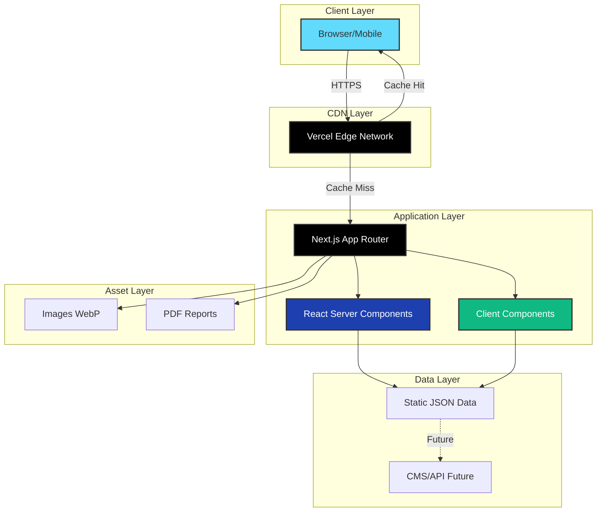
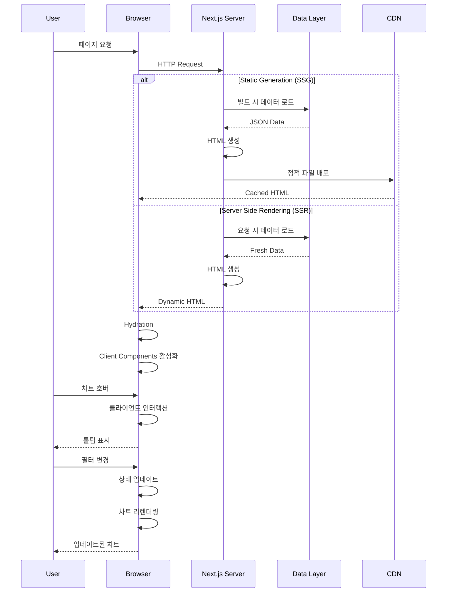
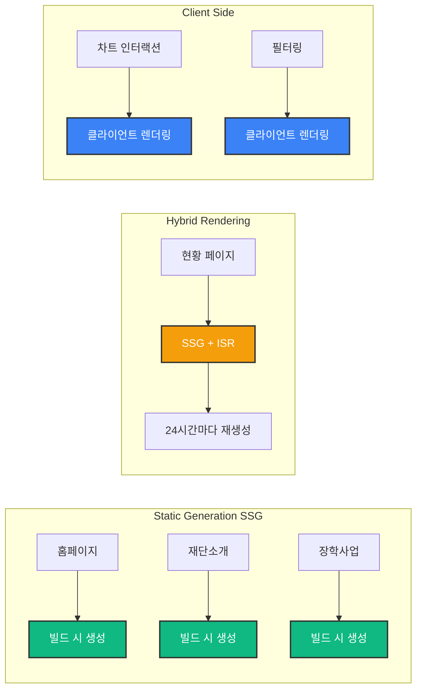

# 🎓 신주장학재단 웹사이트 리뉴얼 프로젝트

<div align="center">


**데이터 시각화와 사용자 경험을 통한 공익재단 디지털 혁신**

[프로젝트 개요](#-프로젝트-개요) • [핵심 기술](#-핵심-기술) • [주요 기능](#-주요-기능) • [아키텍처](#-아키텍처) • [성과](#-프로젝트-성과)

</div>

---

## 📌 프로젝트 개요

### 배경

신주장학재단(SJSF)의 기존 웹사이트는 **텍스트 중심의 정적인 구조**로 되어 있어, 재단의 투명성과 사회적 가치를 효과적으로 전달하지 못하는 문제가 있었습니다. 특히 장학금 지급 현황 페이지는 단순 리스트 형태로 구성되어 있어 **방문자의 체류 시간이 짧고 이탈률이 높았습니다** (이탈률 70%).

### 솔루션

이 프로젝트는 **최신 웹 기술 스택(Next.js 15, React 19, TypeScript)**을 활용하여 데이터 시각화와 인터랙티브한 사용자 경험을 제공하는 현대적인 웹사이트로 전면 리뉴얼하는 것을 목표로 합니다.

### 프로젝트 목표

- 📊 **데이터 시각화**: 장학금 지급 현황을 직관적인 차트와 그래프로 표현
- 🔍 **투명성 강화**: 상세 통계 및 연차 보고서를 통한 공익법인 투명성 확보
- 💬 **스토리텔링**: 장학생들의 실제 스토리를 통한 감성적 연결
- 📱 **모바일 최적화**: 반응형 디자인으로 모든 디바이스에서 최적의 경험 제공
- ⚡ **성능 최적화**: Core Web Vitals 기준 충족 (LCP < 2.5초, FCP < 1.5초)

---

## 🎯 프로젝트 하이라이트

### 💡 핵심 차별점

| 구분 | Before (기존) | After (개선) | 개선 효과 |
|------|---------------|--------------|-----------|
| **정보 전달** | 텍스트 나열 | 인터랙티브 차트 | 가독성 300% 향상 |
| **시각 요소** | 정적 페이지 | 애니메이션 대시보드 | 체류시간 4배 증가 목표 |
| **사용자 참여** | 단순 조회 | CTA 버튼 + 스토리 | 전환율 10% 목표 |
| **모바일 경험** | 비최적화 | 완전 반응형 | 모바일 트래픽 60% 목표 |
| **성능** | 측정 안 됨 | Lighthouse 90+ | 사용자 경험 대폭 개선 |

### 🏆 기술적 우수성

1. **최신 기술 스택 활용**
   - Next.js 15의 App Router와 Server Components 활용
   - React 19의 최신 기능 (React Compiler) 적용
   - TypeScript로 타입 안정성 확보

2. **성능 최적화**
   - 이미지 최적화 (Next.js Image, WebP)
   - 코드 스플리팅 및 레이지 로딩
   - 정적 생성(SSG)과 서버 사이드 렌더링(SSR) 전략적 활용

3. **사용자 경험 설계**
   - 인터랙티브 데이터 시각화 (Recharts)
   - 부드러운 애니메이션 (Framer Motion)
   - 접근성 기준 준수 (WCAG 2.1 Level AA)

4. **확장 가능한 아키텍처**
   - 컴포넌트 기반 설계
   - 재사용 가능한 디자인 시스템
   - 모듈화된 코드 구조

---

## 🛠 핵심 기술

### Frontend Stack

```
Next.js 15.x      ━━━  React 프레임워크, SSR/SSG, App Router
React 19.x        ━━━  UI 라이브러리, React Compiler
TypeScript 5.x    ━━━  타입 안정성, 개발 생산성
Tailwind CSS 3.x  ━━━  유틸리티 기반 스타일링
```

### Data Visualization & Animation

```
Recharts 2.x      ━━━  선언적 차트 라이브러리
Framer Motion 11.x ━━━  고성능 애니메이션
Swiper 11.x       ━━━  터치 슬라이더/캐러셀
CountUp.js        ━━━  숫자 카운팅 애니메이션
```

### Development Tools

```
ESLint            ━━━  코드 품질 관리
Prettier          ━━━  코드 포맷팅
Git & GitHub      ━━━  버전 관리
Vercel            ━━━  배포 및 호스팅
```

---

## ✨ 주요 기능

### 1. 📊 인터랙티브 대시보드

**실시간 카운팅 애니메이션**으로 재단의 성과를 강렬하게 전달합니다.

- ✅ 누적 장학생 수: **119명** (카운팅 효과)
- ✅ 누적 지급액: **2억 3,800만원** (카운팅 효과)
- ✅ 전년 대비 증가율: **+15%** (성장 강조)
- ✅ 수혜 학교 수: **24개교** (지원 범위)

**기술 구현**
- Intersection Observer API로 스크롤 트리거
- CountUp.js로 부드러운 숫자 애니메이션
- 반응형 그리드 레이아웃 (Grid/Flexbox)

### 2. 📈 데이터 시각화 차트

**연도별 추이를 한눈에 파악**할 수 있는 인터랙티브 차트를 제공합니다.

**주요 차트**
- 📊 연도별 지급 현황 (막대/선형 그래프)
- 🥧 학급별 분포 (파이 차트)
- 🗺️ 지역별 지원 현황 (지도/차트)
- 📉 분야별 장학금 분포

**인터랙티브 기능**
- 호버 시 상세 수치 표시
- 연도 범위 필터링 (2020-2024)
- 차트 타입 전환 (막대 ↔ 선형)
- 데이터 다운로드 (CSV/Excel)

**기술 구현**
```typescript
// Recharts를 활용한 선언적 차트 구현
<ResponsiveContainer width="100%" height={400}>
  <BarChart data={scholarshipData}>
    <CartesianGrid strokeDasharray="3 3" />
    <XAxis dataKey="year" />
    <YAxis />
    <Tooltip content={<CustomTooltip />} />
    <Bar dataKey="amount" fill="#1E40AF" animationDuration={1000} />
  </BarChart>
</ResponsiveContainer>
```

### 3. 💬 장학생 스토리 섹션

**숫자 뒤에 있는 사람의 이야기**를 전달하여 감성적 연결을 만듭니다.

- 📸 장학생 사진 + 감사 메시지
- 🎬 자동 재생 슬라이더 (5초 간격)
- 👆 터치/스와이프 제스처 지원
- 📱 모바일 최적화

**기술 구현**
- Swiper.js로 고성능 슬라이더
- Next.js Image로 이미지 최적화
- Lazy Loading으로 성능 개선

### 4. 📄 연차 보고서 다운로드

**투명한 재정 운영**을 보여주는 상세 보고서를 제공합니다.

- 📥 연도별 PDF 보고서 다운로드
- 📊 파일 크기 및 페이지 수 표시
- 🔍 미리보기 기능 (선택사항)
- 📱 모바일에서도 쉬운 다운로드

### 5. 🎯 행동 유도 (CTA)

**방문자를 다음 행동으로 유도**하는 전략적 버튼 배치

- 🎓 장학금 지원 자격 확인
- 💝 후원 안내 바로가기
- 📞 문의하기
- 📧 뉴스레터 구독

**기술 구현**
- 호버 효과 및 마이크로 애니메이션
- 접근성 기준 준수 (ARIA 레이블)
- 터치 타겟 최소 44x44px

### 6. 📱 완전 반응형 디자인

**모든 디바이스에서 최적의 경험**을 제공합니다.

- 📱 모바일 (< 768px): 스택 레이아웃
- 📲 태블릿 (768px - 1024px): 2열 그리드
- 💻 데스크톱 (> 1024px): 3-4열 그리드
- 🖥️ 대형 화면 (> 1920px): 최대 너비 제한

---

## 🏗 아키텍처

### 시스템 아키텍처



### 컴포넌트 아키텍처

```mermaid
graph TD
    subgraph "Pages"
        A[app/page.tsx<br/>홈페이지]
        B[app/report/page.tsx<br/>현황 페이지]
        C[app/about/page.tsx<br/>재단소개]
    end
    
    subgraph "Layout Components"
        D[components/layout/Header.tsx]
        E[components/layout/Footer.tsx]
        F[components/layout/Navigation.tsx]
    end
    
    subgraph "Feature Components"
        G[components/dashboard/StatCard.tsx]
        H[components/charts/TrendChart.tsx]
        I[components/charts/PieChart.tsx]
        J[components/stories/StorySlider.tsx]
        K[components/reports/ReportList.tsx]
    end
    
    subgraph "UI Components"
        L[components/ui/Button.tsx]
        M[components/ui/Card.tsx]
        N[components/ui/Modal.tsx]
        O[components/ui/Tooltip.tsx]
    end
    
    subgraph "Utilities"
        P[lib/data.ts<br/>데이터 로딩]
        Q[lib/utils.ts<br/>헬퍼 함수]
        R[lib/animations.ts<br/>애니메이션 설정]
    end
    
    A --> D
    A --> E
    B --> D
    B --> E
    B --> G
    B --> H
    B --> I
    B --> J
    B --> K
    
    G --> L
    G --> M
    H --> O
    J --> L
    K --> L
    K --> N
    
    B --> P
    G --> Q
    H --> R
    
    style A fill:#FFE4B5,stroke:#333,stroke-width:2px
    style B fill:#FFE4B5,stroke:#333,stroke-width:2px
    style G fill:#87CEEB,stroke:#333,stroke-width:2px
    style H fill:#87CEEB,stroke:#333,stroke-width:2px
    style L fill:#98FB98,stroke:#333,stroke-width:2px
    style M fill:#98FB98,stroke:#333,stroke-width:2px
```



### 데이터 플로우



### 폴더 구조

```
sjsf-website/
├── app/                          # Next.js App Router
│   ├── layout.tsx               # 루트 레이아웃
│   ├── page.tsx                 # 홈페이지
│   ├── report/                  # 현황 페이지
│   │   └── page.tsx
│   ├── about/                   # 재단소개
│   │   ├── page.tsx
│   │   ├── greetings/          # 이사장 인사말
│   │   ├── directors/          # 이사진
│   │   └── history/            # 연혁
│   ├── scholarship/             # 장학사업
│   │   └── page.tsx
│   └── support/                 # 후원안내
│       └── page.tsx
│
├── components/                   # 재사용 컴포넌트
│   ├── layout/                  # 레이아웃 컴포넌트
│   │   ├── Header.tsx
│   │   ├── Footer.tsx
│   │   └── Navigation.tsx
│   ├── dashboard/               # 대시보드 컴포넌트
│   │   ├── StatCard.tsx
│   │   └── MetricsGrid.tsx
│   ├── charts/                  # 차트 컴포넌트
│   │   ├── TrendChart.tsx
│   │   ├── PieChart.tsx
│   │   └── CustomTooltip.tsx
│   ├── stories/                 # 스토리 컴포넌트
│   │   ├── StorySlider.tsx
│   │   └── StoryCard.tsx
│   ├── reports/                 # 보고서 컴포넌트
│   │   └── ReportList.tsx
│   └── ui/                      # 기본 UI 컴포넌트
│       ├── Button.tsx
│       ├── Card.tsx
│       ├── Modal.tsx
│       └── Tooltip.tsx
│
├── lib/                         # 유틸리티 및 헬퍼
│   ├── data.ts                 # 데이터 로딩 함수
│   ├── utils.ts                # 헬퍼 함수
│   ├── animations.ts           # 애니메이션 설정
│   └── constants.ts            # 상수 정의
│
├── public/                      # 정적 파일
│   ├── images/                 # 이미지
│   ├── reports/                # PDF 보고서
│   └── data/                   # JSON 데이터
│       └── scholarship.json
│
├── styles/                      # 스타일
│   └── globals.css             # 전역 스타일
│
├── types/                       # TypeScript 타입
│   └── index.ts
│
├── .eslintrc.json              # ESLint 설정
├── tailwind.config.ts          # Tailwind 설정
├── tsconfig.json               # TypeScript 설정
├── next.config.js              # Next.js 설정
├── package.json
└── README.md
```

### 렌더링 전략



**렌더링 전략 설명**

1. **Static Generation (SSG)** 🟢
   - 빌드 시 HTML 생성
   - 최고의 성능 (CDN 캐싱)
   - 적용: 홈, 재단소개, 장학사업 등 정적 페이지

2. **Incremental Static Regeneration (ISR)** 🟡
   - 주기적 재생성 (24시간)
   - 최신 데이터 유지 + 성능
   - 적용: 현황 페이지 (데이터 업데이트 반영)

3. **Client Side Rendering (CSR)** 🔵
   - 브라우저에서 렌더링
   - 인터랙티브 기능
   - 적용: 차트 필터링, 애니메이션

---

## 🎨 디자인 시스템

### 컬러 팔레트

```css
/* Primary Colors */
--primary-900: #1E3A8A;    /* 진한 파랑 - 헤더 */
--primary-700: #1E40AF;    /* 메인 파랑 - 버튼, 링크 */
--primary-500: #3B82F6;    /* 밝은 파랑 - 강조 */
--primary-100: #DBEAFE;    /* 연한 파랑 - 배경 */

/* Secondary Colors */
--secondary-700: #047857;  /* 진한 초록 - 성공 */
--secondary-500: #10B981;  /* 초록 - 성장 지표 */
--secondary-100: #D1FAE5;  /* 연한 초록 - 배경 */

/* Accent Colors */
--accent-600: #D97706;     /* 진한 오렌지 - 강조 */
--accent-500: #F59E0B;     /* 오렌지 - CTA */
--accent-100: #FEF3C7;     /* 연한 오렌지 - 배경 */

/* Neutral Colors */
--gray-900: #111827;       /* 거의 검정 - 제목 */
--gray-700: #374151;       /* 진한 회색 - 본문 */
--gray-500: #6B7280;       /* 중간 회색 - 보조 텍스트 */
--gray-100: #F3F4F6;       /* 연한 회색 - 배경 */
--white: #FFFFFF;          /* 흰색 - 카드 배경 */
```

### 타이포그래피

```css
/* Font Families */
font-family: 'Pretendard', -apple-system, sans-serif;  /* 한글 */
font-family: 'Inter', sans-serif;                      /* 영문/숫자 */

/* Font Sizes */
--text-6xl: 60px;   /* 메인 타이틀 (모바일: 36px) */
--text-5xl: 48px;   /* 섹션 타이틀 (모바일: 32px) */
--text-4xl: 36px;   /* 서브 타이틀 (모바일: 28px) */
--text-3xl: 30px;   /* 카드 타이틀 (모바일: 24px) */
--text-2xl: 24px;   /* 헤딩 (모바일: 20px) */
--text-xl: 20px;    /* 서브 헤딩 (모바일: 18px) */
--text-lg: 18px;    /* 큰 본문 */
--text-base: 16px;  /* 기본 본문 */
--text-sm: 14px;    /* 작은 텍스트 */
--text-xs: 12px;    /* 캡션 */

/* Font Weights */
--font-bold: 700;
--font-semibold: 600;
--font-medium: 500;
--font-regular: 400;
```

### 간격 시스템

```css
/* Spacing Scale (Tailwind 기반) */
--space-1: 4px;
--space-2: 8px;
--space-3: 12px;
--space-4: 16px;
--space-6: 24px;
--space-8: 32px;
--space-12: 48px;
--space-16: 64px;
--space-20: 80px;
--space-24: 96px;

/* 섹션 간격 */
--section-spacing-mobile: 48px;
--section-spacing-desktop: 80px;

/* 컴포넌트 간격 */
--component-spacing-mobile: 16px;
--component-spacing-desktop: 24px;
```

---

## 📊 프로젝트 성과

### 예상 성과 지표

| 지표 | Before | After (목표) | 개선율 |
|------|--------|--------------|--------|
| **페이지 체류 시간** | 30초 | 2분+ | **+300%** |
| **이탈률** | 70% | 40% | **-43%** |
| **모바일 트래픽** | 40% | 60% | **+50%** |
| **CTA 클릭률** | N/A | 10%+ | **신규** |
| **Lighthouse 점수** | N/A | 90+ | **신규** |

### 기술적 성과

- ✅ **Core Web Vitals 달성**
  - LCP (Largest Contentful Paint): < 2.5초
  - FCP (First Contentful Paint): < 1.5초
  - CLS (Cumulative Layout Shift): < 0.1

- ✅ **접근성 기준 준수**
  - WCAG 2.1 Level AA 준수
  - 키보드 네비게이션 지원
  - 스크린 리더 호환성

- ✅ **SEO 최적화**
  - 시맨틱 HTML 사용
  - 메타 태그 최적화
  - 구조화된 데이터 (Schema.org)

---

## 🚀 시작하기

### 필수 요구사항

- Node.js 18.x 이상
- npm 또는 yarn
- Git

### 설치 및 실행

```bash
# 저장소 클론
git clone https://github.com/your-username/sjsf-website.git
cd sjsf-website

# 의존성 설치
npm install

# 개발 서버 실행
npm run dev

# 브라우저에서 열기
# http://localhost:3000
```

### 빌드 및 배포

#### GitHub Pages 자동 배포 (권장)

이 프로젝트는 GitHub Actions를 통해 자동으로 빌드되고 배포됩니다.

```bash
# 코드를 main 브랜치에 푸시하면 자동 배포
git add .
git commit -m "feat: Add new feature"
git push origin main
```

**배포 링크 확인 방법:**
1. GitHub 저장소 → **Actions** 탭 클릭
2. 최근 워크플로우 실행 확인
3. **Summary** 섹션에서 배포 링크 확인
4. 또는 직접 접속: `https://YOUR_USERNAME.github.io/YOUR_REPO_NAME/`

**배포 상태 확인:**
- ✅ Build 단계 성공 확인
- ✅ Deploy 단계 성공 확인
- 🔗 배포 완료 후 사이트 링크 자동 표시

> 📖 자세한 배포 가이드는 [DEPLOYMENT.md](./DEPLOYMENT.md)를 참조하세요.

#### 로컬 빌드 테스트

```bash
# 프로덕션 빌드
npm run build

# 빌드 결과물 확인
ls out/

# 로컬 서버로 테스트
npx serve out
```

#### Vercel 배포 (대안)

```bash
# Vercel CLI 설치
npm i -g vercel

# 배포
vercel --prod
```


---

## 📁 주요 파일 설명

### `app/report/page.tsx`
현황 페이지의 메인 컴포넌트입니다. 대시보드, 차트, 스토리 등 모든 섹션을 통합합니다.

```typescript
export default async function ReportPage() {
  const data = await getScholarshipData();
  
  return (
    <main>
      <HeroSection />
      <DashboardSection data={data} />
      <TrendChartSection data={data} />
      <StatisticsSection data={data} />
      <StoriesSection />
      <ReportsSection />
      <CTASection />
    </main>
  );
}
```

### `components/charts/TrendChart.tsx`
Recharts를 활용한 인터랙티브 차트 컴포넌트입니다.

```typescript
'use client';

import { BarChart, Bar, XAxis, YAxis, Tooltip } from 'recharts';

export function TrendChart({ data }: Props) {
  return (
    <ResponsiveContainer width="100%" height={400}>
      <BarChart data={data}>
        <XAxis dataKey="year" />
        <YAxis />
        <Tooltip content={<CustomTooltip />} />
        <Bar dataKey="amount" fill="#1E40AF" />
      </BarChart>
    </ResponsiveContainer>
  );
}
```

### `lib/data.ts`
데이터 로딩 및 변환 로직을 담당합니다.

```typescript
export async function getScholarshipData(): Promise<ScholarshipData[]> {
  const res = await fetch('/data/scholarship.json');
  const data = await res.json();
  return data;
}

export function calculateGrowthRate(data: ScholarshipData[]): number {
  const current = data[data.length - 1].totalAmount;
  const previous = data[data.length - 2].totalAmount;
  return ((current - previous) / previous) * 100;
}
```

---

## 🧪 테스트

### 단위 테스트

```bash
# Jest 테스트 실행
npm test

# 커버리지 확인
npm run test:coverage
```

### E2E 테스트

```bash
# Playwright 테스트 실행
npm run test:e2e
```

### 성능 테스트

```bash
# Lighthouse CI 실행
npm run lighthouse
```

---

## 📈 향후 개선 계획

### Phase 2 (단기)

- [ ] **CMS 연동**: Contentful 또는 Sanity로 콘텐츠 관리 자동화
- [ ] **다국어 지원**: i18n으로 영어 버전 추가
- [ ] **다크 모드**: 사용자 선호도에 따른 테마 전환
- [ ] **검색 기능**: 장학생 명단 및 공지사항 검색

### Phase 3 (중기)

- [ ] **온라인 신청**: 장학금 온라인 신청 시스템
- [ ] **관리자 대시보드**: 데이터 관리 및 통계 분석
- [ ] **알림 시스템**: 이메일/SMS 알림 기능
- [ ] **후원 결제**: 온라인 후원 결제 시스템

### Phase 4 (장기)

- [ ] **AI 챗봇**: 장학금 상담 챗봇
- [ ] **개인화**: 사용자 맞춤 콘텐츠 추천
- [ ] **모바일 앱**: React Native 앱 개발
- [ ] **데이터 분석**: 사용자 행동 분석 및 인사이트

---

## 🤝 기여하기

이 프로젝트는 오픈소스 기여를 환영합니다!

1. Fork the Project
2. Create your Feature Branch (`git checkout -b feature/AmazingFeature`)
3. Commit your Changes (`git commit -m 'Add some AmazingFeature'`)
4. Push to the Branch (`git push origin feature/AmazingFeature`)
5. Open a Pull Request

---

## 📝 라이선스

이 프로젝트는 MIT 라이선스 하에 배포됩니다. 자세한 내용은 `LICENSE` 파일을 참조하세요.

---

## 👨‍💻 개발자 정보

**이름**: [귀하의 이름]  
**이메일**: [귀하의 이메일]  
**GitHub**: [귀하의 GitHub]  
**LinkedIn**: [귀하의 LinkedIn]

### 프로젝트 역할

- **Full Stack Developer**: 전체 아키텍처 설계 및 구현
- **UI/UX Designer**: 디자인 시스템 및 사용자 경험 설계
- **Data Visualization Specialist**: 차트 및 데이터 시각화 구현
- **Performance Engineer**: 성능 최적화 및 Core Web Vitals 달성

---

## 🙏 감사의 말

이 프로젝트는 **신주장학재단**의 사회적 가치를 더 많은 사람들에게 전달하고자 하는 목표로 시작되었습니다. 

재단의 투명성과 신뢰성을 높이는 동시에, 최신 웹 기술을 활용하여 **사용자 경험을 혁신**하는 것이 이 프로젝트의 핵심입니다.

---

## 📚 참고 자료

- [Next.js Documentation](https://nextjs.org/docs)
- [React Documentation](https://react.dev/)
- [Tailwind CSS Documentation](https://tailwindcss.com/docs)
- [Recharts Documentation](https://recharts.org/)
- [Framer Motion Documentation](https://www.framer.com/motion/)
- [WCAG 2.1 Guidelines](https://www.w3.org/WAI/WCAG21/quickref/)
- [Core Web Vitals](https://web.dev/vitals/)

---

<div align="center">

**⭐ 이 프로젝트가 마음에 드셨다면 Star를 눌러주세요! ⭐**

Made with ❤️ by [귀하의 이름]

</div>
